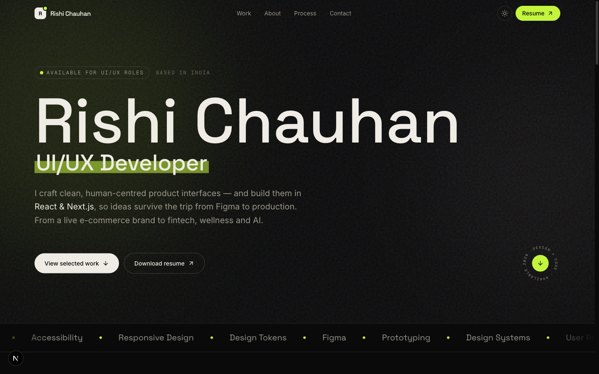

<div align="center">

# Rishi Chauhan — UI/UX Developer · Portfolio

**Designing & building clean, human-centred product interfaces.**

[Live site](https://rishi-portfolio-alpha-eight.vercel.app) · [Résumé (PDF)](./public/rishi-chauhan-cv.pdf) · [Figma kit](./figma-kit)



</div>

---

An extraordinary, hand-built portfolio: an editorial dark/light interface, four full
case studies, in-browser project mockups, and a Figma design kit that stays in sync with the site.

## ✦ Highlights

- **4 case studies** — a *live* e-commerce brand ([Shree Navya](https://www.shreenavyafoodproducts.com/)) plus three new-gen concepts (fintech, wellness, AI).
- **Faithful rebuild** — the Shree Navya storefront recreated pixel-for-pixel inside the site.
- **Figma-connected** — every project ships editable SVG artboards + a one-click Figma plugin, with live-embed slots in each case study.
- **Design system** — token-driven theming, dark/light, a premium type stack (Space Grotesk · Inter · Instrument Serif) and tasteful motion.
- **Accessible & fast** — semantic HTML, keyboard-friendly, reduced-motion aware, statically generated.

## 🛠 Built with

`Next.js 16` · `React 19` · `TypeScript` · `Tailwind CSS v4` · `Framer Motion` · `lucide-react`

## 🚀 Run locally

```bash
npm install
npm run dev        # http://localhost:3000
npm run build      # production build
```

## 🎨 Figma design kit

```bash
node scripts/gen-figma-artboards.mjs   # regenerate the SVG artboards + Figma plugin
```

Drag `public/figma/*.svg` into Figma (they become editable frames), or run the bundled
plugin in `figma-kit/` for native frames. Full guide: [`figma-kit/README.md`](./figma-kit/README.md).

## 📁 Structure

```
src/
├─ app/                    # routes: home + /work/<slug> case studies
├─ components/             # nav, footer, hero, case-study primitives, project mocks
│  └─ replicas/            # faithful Shree Navya rebuild
└─ lib/                    # site config + project data
public/figma/              # SVG artboards (Figma-importable + case-study posters)
figma-kit/                 # Figma plugin + import guide
scripts/                   # artboard generator
```

## ✏️ Make it yours

- Contact + social links → [`src/lib/site.ts`](./src/lib/site.ts)
- Project copy/metadata → [`src/lib/projects.ts`](./src/lib/projects.ts)
- Paste a Figma share link into a project's `figma` field to turn its embed slot live.

---

<div align="center">
Designed &amp; built from scratch by <b>Rishi Chauhan</b>.
</div>
